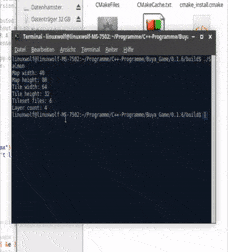

# The RawSalmonEngine 
A game engine utilising *"Tiled" map files*.

This was originally meant to be the foundation of a game somewhat in between
Baldur's Gate, Planescape Torment and Divine Divinity. The current state of 
the project is fairly universal and resembles a **basic map renderer for tmx 
files**. The ultimate goal of this project is to implement a full fledged
game development environment via *Tiled*. The currently used **Tiled Version** is **1.0.2**
## Features 
* Supported map orientations
  - [x] Orthogonal
  - [ ] Isometric
* Supported map formats
  - [ ] CSV
  - [x] base64
  - [ ] base64(zlib)
* Supported draw order
  - [x] right-down
  - [ ] right-up
  - [ ] left-down
  - [ ] left-up
* Adaptive offscreen tile culling
* Full animation support
* Layer offset and tileset offset
* Oversized tiles which can reach from borders into the screen
* Tilesets can have *Alpha*, *Add* or *Color Modulate* Blend Mode
* Image Layers
* It actually works!

## Dependencies
* **[SDL](http://www.libsdl.org/)** **2.0.0**+

## Compile and install 
For Linux run:

    $ mkdir build
    $ cd build
    $ cmake ..
    $ make
    
## Usage
* ./Salmon
* Loads /data/example.tmx
* Move the camera via arrow keys and wasd.
## Contact
* [Agouti Games (EN)](http://game.moonlighthiker.de/index.php/en/)
* [Agouti Games (DE)](http://game.moonlighthiker.de/index.php/de/)
* [Discord Server](https://discord.gg/thAaD9e)
## Why Salmon?
We needed some kind of animal mascot and we thought about the main protagonists 
of our future game. Since they are tribal anthropomorphic big cats we were sure
that it had to be some kind of a fish. The *raw* aspect relates to this being my
first ever somewhat serious project, so it will be far from perfect.
